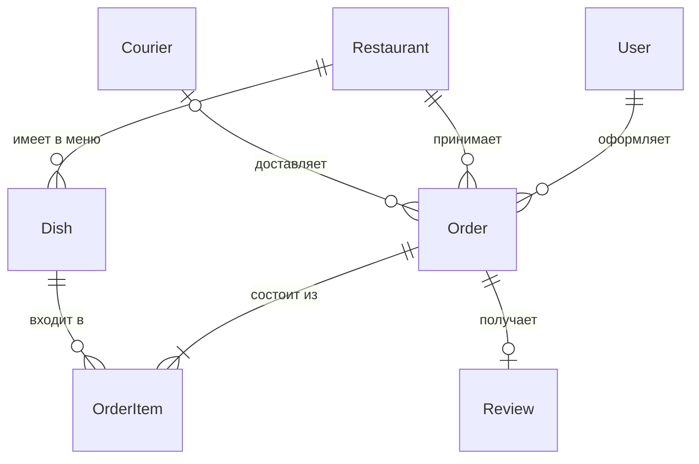

# ДЗ №1. Задание 1. Концептуальная модель

**Домен:** служба доставки еды (Вариант №2).

Концептуальная модель отвечает на вопрос «о чём вообще эта система?»: какие есть сущности и как они связаны. Атрибутов, типов данных и ключей здесь ещё нет — они появятся в логической модели.

## Сущности

| Сущность | Что это в бизнесе | Из какого требования появилась |
|---|---|---|
| **User** (пользователь) | клиент, который заказывает еду | «Пользователи могут просматривать рестораны, их меню, делать заказы» |
| **Restaurant** (ресторан) | заведение, которое готовит еду | «доставка еды из ресторанов»; «отзывы о ресторанах» |
| **Dish** (блюдо) | позиция в меню ресторана | «У каждого ресторана есть меню с блюдами» |
| **Order** (заказ) | факт оформления заказа клиентом | «делать заказы» |
| **OrderItem** (позиция заказа) | «строка чека»: какое блюдо и сколько порций | «В заказе может быть несколько блюд с указанием количества» |
| **Courier** (курьер) | человек, который везёт заказ | «Курьеры доставляют заказы» |
| **Review** (отзыв) | оценка ресторана и доставки | «пользователи могут оставлять отзывы о ресторанах и доставке» |

Всего 7 сущностей (требовалось не менее 6).

## Диаграмма

Обозначения (нотация «воронья лапка»): `||` — ровно один, `|o` / `o|` — ноль или один, `o{` — ноль или много, `|{` — один или много.

## Связи и как бизнес-требования на них повлияли

| Связь | Кардинальность | Почему так |
|---|---|---|
| User — Order | 1 : N | Один клиент делает много заказов, а у заказа всегда ровно один клиент. |
| Restaurant — Order | 1 : N | Заказ оформляется в одном ресторане (в нём блюда одного меню). |
| Restaurant — Dish | 1 : N | «У каждого ресторана есть меню» — блюдо принадлежит одному ресторану. |
| Order — Dish | **M : N** | В заказе много блюд, и одно блюдо попадает во много заказов. Связь M:N нельзя хранить напрямую, поэтому появилась **ассоциативная сущность OrderItem**; к тому же «количество» — свойство именно пары «заказ + блюдо». |
| Courier — Order | 1 : N, **необязательная** со стороны заказа | Заказ создаётся раньше, чем ему назначают курьера, поэтому у заказа курьера может пока не быть. |
| Order — Review | 1 : 0..1 | Отзыв привязан к заказу: оставить его может только тот, кто заказывал, и один раз. По заказу же определяются и ресторан, и курьер, о которых отзыв. |

## Отдельно про две «Дополнительные рекомендации» из задания

- **Статус заказа** (создан → готовится → передан курьеру → доставлен): это свойство заказа, отдельная сущность на этом этапе не нужна. Подробности — в логической модели; полная история статусов добавлена в ДЗ №2.
- **Актуальное меню и изменение цен:** блюдо хранит *текущую* цену, а позиция заказа (OrderItem) — *цену на момент заказа*. Поэтому изменение меню не портит старые заказы.
