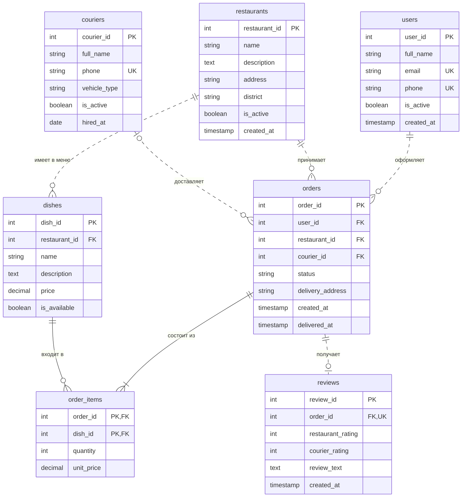

# ДЗ №1. Задание 2. Логическая модель

Логическая модель — это концептуальная модель + атрибуты + ключи + точные кардинальности. Она ещё не привязана к конкретной СУБД (типы указаны общие). Названия таблиц: `users` и `orders` — во множественном числе, потому что `USER` и `ORDER` — зарезервированные слова SQL.

## ER-диаграмма (нотация «воронья лапка»)

Сплошная линия — **идентифицирующая** связь, пунктирная — **неидентифицирующая**.

## Атрибуты, ключи и как требования повлияли на выбор

### users — клиенты
| Атрибут | Ключ | Зачем / из какого требования |
|---|---|---|
| user_id | PK | суррогатный ключ: email и телефон могут меняться |
| full_name | | имя клиента |
| email | UK | «Пользователи могут делать заказы» → у клиента должен быть аккаунт; один email — один аккаунт |
| phone | UK | курьеру нужен контакт клиента |
| is_active | | клиента «выключаем», а не удаляем — у него остаются заказы |
| created_at | | дата регистрации |

### restaurants — рестораны
| Атрибут | Ключ | Зачем / из какого требования |
|---|---|---|
| restaurant_id | PK | |
| name, description | | «пользователи могут просматривать рестораны» |
| address | | место, откуда забирают заказ; `UK (name, address)` — нет двух одинаковых точек |
| district | | нужен для запроса «рестораны, работающие в этом районе» |
| is_active | | скрыть ресторан из выдачи, не теряя историю заказов |
| created_at | | |

### couriers — курьеры
| Атрибут | Ключ | Зачем / из какого требования |
|---|---|---|
| courier_id | PK | |
| full_name, phone | phone — UK | контакты курьера |
| vehicle_type | | способ доставки (пешком / велосипед / скутер / авто), допустимые значения ограничены |
| is_active | | работает ли курьер сейчас в сервисе |
| hired_at | | дата найма |

### dishes — блюда меню
| Атрибут | Ключ | Зачем / из какого требования |
|---|---|---|
| dish_id | PK | |
| restaurant_id | FK → restaurants | «У каждого ресторана есть меню» → блюдо принадлежит ровно одному ресторану, `NOT NULL` |
| name, description | | `UK (restaurant_id, name)` — в одном меню нет двух блюд с одинаковым названием |
| price | | **текущая** цена, строго больше 0 |
| is_available | | «Актуальное меню»: блюдо выключаем, а не удаляем, иначе сломается история заказов |

### orders — заказы
| Атрибут | Ключ | Зачем / из какого требования |
|---|---|---|
| order_id | PK | |
| user_id | FK → users | кто заказал, `NOT NULL` |
| restaurant_id | FK → restaurants | где заказали, `NOT NULL` |
| courier_id | FK → couriers | «Курьеры доставляют заказы»; **может быть NULL** — пока курьер не назначен |
| status | | «создан → готовится → передан курьеру → доставлен» (+ «отменён»); значения ограничены `CHECK` |
| delivery_address | | куда везти, `NOT NULL` |
| created_at, delivered_at | | время оформления и доставки; `delivered_at` заполнен только у доставленных заказов |

Бизнес-правила прямо в ограничениях: нельзя передать курьеру или доставить заказ, пока курьер не назначен; время доставки заполнено только при статусе «доставлен» и не раньше времени создания.

### order_items — позиции заказа (разрешение связи M:N)
| Атрибут | Ключ | Зачем / из какого требования |
|---|---|---|
| order_id | PK, FK → orders | |
| dish_id | PK, FK → dishes | |
| quantity | | «блюда с указанием количества», строго больше 0 |
| unit_price | | цена блюда **на момент заказа** (снимок). Меню меняется, а сумма старого заказа — нет |

Составной ключ `(order_id, dish_id)`: одно блюдо в заказе — одна строка; две порции = `quantity = 2`.

### reviews — отзывы
| Атрибут | Ключ | Зачем / из какого требования |
|---|---|---|
| review_id | PK | |
| order_id | FK → orders, UK | «отзывы о ресторанах и доставке» → отзыв привязан к заказу: отзывается только заказавший, один раз (UNIQUE) |
| restaurant_rating | | оценка ресторана 1–5, обязательна |
| courier_rating | | оценка доставки 1–5, можно не ставить (NULL) |
| review_text, created_at | | текст и дата |

Ресторан и курьер в `reviews` не дублируются — они определяются через заказ (нет риска, что в отзыве ресторан один, а в заказе другой).

## Кардинальности

| Связь | Родитель → потомок | Кардинальность | Опциональность |
|---|---|---|---|
| users — orders | users → orders | 1 : N | у пользователя может быть 0 заказов; заказ всегда имеет пользователя |
| restaurants — orders | restaurants → orders | 1 : N | заказ всегда принадлежит ресторану |
| restaurants — dishes | restaurants → dishes | 1 : N | у ресторана может быть 0 блюд; блюдо всегда принадлежит ресторану |
| couriers — orders | couriers → orders | 1 : N | **у заказа курьера может не быть** (0..1), у курьера 0..N заказов |
| orders — order_items | orders → order_items | 1 : N (1..N) | в заказе минимум одна позиция |
| dishes — order_items | dishes → order_items | 1 : N | блюдо может ни разу не заказываться |
| orders — reviews | orders → reviews | 1 : 0..1 | отзыв необязателен, но не более одного |

> Правило «в заказе минимум одна позиция» на уровне таблиц обычными ограничениями не проверить — его контролирует приложение (или триггер).

## Идентифицирующие и неидентифицирующие связи

**Идентифицирующая связь** — когда внешний ключ родителя входит в первичный ключ дочерней таблицы (потомок не существует и не идентифицируется без родителя). **Неидентифицирующая** — внешний ключ лежит в потомке как обычный атрибут, у потомка есть собственный первичный ключ.

| Связь | Тип | Обоснование |
|---|---|---|
| orders → order_items | **идентифицирующая** | `order_id` входит в PK `(order_id, dish_id)`: позиция не имеет смысла без заказа |
| dishes → order_items | **идентифицирующая** | `dish_id` тоже входит в составной PK |
| users → orders | неидентифицирующая | у заказа свой `order_id`; `user_id` — обычный FK |
| restaurants → orders | неидентифицирующая | то же самое |
| couriers → orders | неидентифицирующая (опциональная) | FK может быть NULL, а значит по определению не может входить в PK |
| restaurants → dishes | неидентифицирующая | у блюда свой `dish_id`; блюдо можно идентифицировать отдельно от ресторана |
| orders → reviews | неидентифицирующая | у отзыва свой `review_id`; `order_id` — FK с ограничением UNIQUE |

## Ответы на «Дополнительные рекомендации» из задания

**Как хранить статус заказа.** Текущий статус — колонка `orders.status` (`VARCHAR` + `CHECK` на список значений). Так проще всего: значений мало и они стабильны. Вариант «отдельная таблица-справочник статусов» дал бы лишние JOIN-ы без пользы для 5 значений. Историю смены статусов вынесли в отдельную таблицу `order_status_history` (ДЗ №2).

**Как хранить актуальное меню.** `dishes.price` — текущая цена, `dishes.is_available` — есть блюдо в меню или нет. В `order_items.unit_price` записывается цена на момент заказа. Блюда с историей никогда не удаляются физически (внешний ключ `ON DELETE RESTRICT`), только выключаются.
