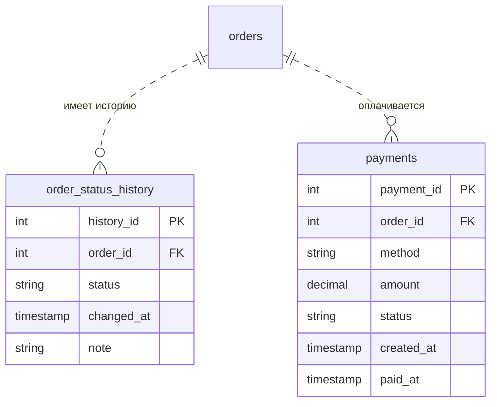

# ДЗ №2. Документация (Food Delivery)

Схема из ДЗ №1 (`hw1/03_physical_model.sql`) дополнена двумя таблицами, актуализированы индексы под частые запросы, подготовлен скрипт с пятью демонстрациями нарушений ограничений.

Файлы сдачи:

| Что требуется в задании | Файл |
|---|---|
| SQL с созданием новых таблиц и индексами | `hw2/01_schema_additions.sql` |
| Скрипт демонстрации нарушений | `hw2/03_constraint_violations_demo.sql` (данные для него — `hw2/02_seed_data.sql`) |
| Документация (таблица + выводы) | этот файл |

---

## Часть 1. Дополнение схемы

### 1.1. Две новые таблицы



**`order_status_history` — история статусов заказа.**
Почему появилась: в `orders.status` лежит только текущий статус, а вопрос «когда заказ передали курьеру и как долго он готовился» требует истории (это же рекомендация из ДЗ №1 про статусы).

| Ограничение | Какое бизнес-правило защищает |
|---|---|
| `PK (history_id)` | у каждой записи истории есть свой идентификатор |
| `FK order_id → orders ON DELETE CASCADE` | история — часть заказа: удалили заказ → удалилась история |
| `NOT NULL` на `order_id`, `status`, `changed_at` | запись без заказа, статуса или времени бессмысленна |
| `CHECK status IN (...)` | статусы те же, что в `orders` |
| `UNIQUE (order_id, status)` | каждый статус у заказа фиксируется один раз; заодно это индекс для выборки истории по `order_id` |

**`payments` — оплата заказа.**
Почему появилась: оплата — отдельный факт со своим жизненным циклом. Попыток оплаты у заказа может быть несколько (первая не прошла — вторая прошла), значит связь 1:N.

| Ограничение | Какое бизнес-правило защищает |
|---|---|
| `PK (payment_id)` | |
| `FK order_id → orders ON DELETE RESTRICT` | финансовые записи не должны пропадать вместе с заказом |
| `CHECK method IN ('card','cash','sbp')` | только поддерживаемые способы оплаты |
| `CHECK amount > 0` | платёж на 0 или отрицательную сумму невозможен |
| `CHECK status IN ('pending','paid','failed','refunded')` | допустимые состояния платежа |
| `CHECK ((status IN ('paid','refunded')) = (paid_at IS NOT NULL))` | время оплаты заполнено тогда и только тогда, когда деньги получены |
| `UNIQUE INDEX (order_id) WHERE status = 'paid'` | **частичный** уникальный индекс: заказ нельзя оплатить дважды, а неудачных попыток может быть сколько угодно |

### 1.2. Политика удаления для всех внешних ключей

| Внешний ключ | ON DELETE | Почему |
|---|---|---|
| `dishes.restaurant_id → restaurants` | CASCADE | меню — часть ресторана |
| `orders.user_id → users` | RESTRICT | нельзя удалить клиента, у которого есть заказы (вместо этого `is_active = FALSE`) |
| `orders.restaurant_id → restaurants` | RESTRICT | нельзя удалить ресторан с историей заказов |
| `orders.courier_id → couriers` | RESTRICT | то же для курьера; `SET NULL` не подошёл бы — он нарушил бы `chk_orders_courier_required` |
| `order_items.order_id → orders` | CASCADE | позиции — часть заказа |
| `order_items.dish_id → dishes` | RESTRICT | нельзя удалить блюдо, которое есть в чужих заказах (вместо этого `is_available = FALSE`) |
| `reviews.order_id → orders` | CASCADE | отзыв без заказа бессмыслен |
| `order_status_history.order_id → orders` | CASCADE | история — часть заказа |
| `payments.order_id → orders` | RESTRICT | деньги не исчезают вместе с заказом |

Итог: заказ с платежом физически удалить нельзя — его отменяют статусом `cancelled`. Это осознанное решение: в реальном сервисе заказы не удаляют.

### 1.3. Связь M:N (дополнительный балл)

**Где в модели M:N.** Заказ содержит много блюд, блюдо входит во много заказов: `orders` ↔ `dishes`.

**Как реализовано.** Через ассоциативную (связующую) таблицу `order_items`:

- два внешних ключа: `order_id → orders` и `dish_id → dishes`;
- **составной первичный ключ** `(order_id, dish_id)` — одно блюдо в заказе не может встретиться двумя строками;
- собственные атрибуты связи: `quantity` и `unit_price` (цена на момент заказа).

**Почему так, а не иначе.**

| Альтернатива | Почему отвергнута |
|---|---|
| Массив или JSONB со списком блюд в `orders` | нет внешнего ключа — база не проверит, что блюдо существует; трудно считать «топ блюд» и выручку; нарушение первой нормальной формы |
| Колонки `dish1`, `dish2`, ... в `orders` | не масштабируется и не расширяется |
| Связующая таблица с суррогатным `item_id` + `UNIQUE (order_id, dish_id)` | работает, но составной PK проще: он сам запрещает дубли и не требует лишнего столбца и индекса |

Компромисс: если появятся модификаторы («пицца без лука» и «пицца с двойным сыром» в одном заказе), составной ключ придётся заменить на суррогатный.

**Что будет при `DROP TABLE ... CASCADE`.**

Важно не путать два разных CASCADE:

| | Когда срабатывает | Что делает |
|---|---|---|
| `ON DELETE CASCADE` в описании внешнего ключа | при удалении **строки** (`DELETE`) | удаляет связанные строки в дочерней таблице |
| `DROP TABLE ... CASCADE` | при удалении **таблицы** | удаляет объекты, которые от неё зависят (внешние ключи, представления). **Дочерние таблицы и их данные остаются** |

Что получится в нашей схеме:

- `DROP TABLE dishes;` без `CASCADE` завершится ошибкой: *cannot drop table dishes because other objects depend on it* — от неё зависит внешний ключ `fk_order_items_dish`.
- `DROP TABLE dishes CASCADE;` таблицу `dishes` удалит и **снимет внешний ключ** `fk_order_items_dish`. Таблица `order_items` со всеми строками останется, но `dish_id` в ней превратится в «висящие» числа без проверки — целостность потеряна.
- `DROP TABLE orders CASCADE;` аналогично снимет внешние ключи с `order_items`, `reviews`, `order_status_history` и `payments`, сами эти таблицы останутся.
- `DROP SCHEMA ... CASCADE` — другой случай: удаляет вообще все объекты внутри схемы, включая таблицы с данными.

Проверить безопасно, ничего не ломая (в PostgreSQL DDL транзакционен):

```sql
BEGIN;
DROP TABLE dishes CASCADE;          -- NOTICE: drop cascades to constraint fk_order_items_dish on table order_items
SELECT COUNT(*) FROM order_items;   -- строки на месте (при загруженных тестовых данных — 11)
ROLLBACK;                           -- всё вернулось как было
```

Поэтому в скриптах воспроизведения (`hw1/03`) при повторном запуске удаляются **все** таблицы схемы, включая таблицы ДЗ №2: иначе после `DROP TABLE orders CASCADE` дочерние таблицы остались бы без внешних ключей.

### 1.4. Индексы под частые запросы

В ДЗ №1 созданы индексы на внешние ключи (PostgreSQL автоматически индексирует только PRIMARY KEY и UNIQUE, но не FOREIGN KEY). В ДЗ №2 они актуализированы под пять частых запросов.

**Q1. Рестораны района с рейтингом выше 4,5**
```sql
SELECT r.restaurant_id, r.name,
       ROUND(AVG(rv.restaurant_rating), 2) AS avg_rating,
       COUNT(rv.review_id)                 AS reviews_count
FROM restaurants r
JOIN orders  o  ON o.restaurant_id = r.restaurant_id
JOIN reviews rv ON rv.order_id     = o.order_id
WHERE r.district = 'Центральный' AND r.is_active
GROUP BY r.restaurant_id, r.name
HAVING AVG(rv.restaurant_rating) > 4.5
ORDER BY avg_rating DESC;
```
Индексы: `idx_restaurants_district_active` (частичный, только активные рестораны района) → `idx_orders_restaurant_created` (заказы ресторана) → `uq_reviews_order` (отзыв по заказу).

**Q2. Актуальное меню ресторана**
```sql
SELECT dish_id, name, description, price
FROM dishes
WHERE restaurant_id = 1 AND is_available
ORDER BY name;
```
Индекс: `uq_dishes_restaurant_name (restaurant_id, name)` — находит блюда ресторана и отдаёт их уже отсортированными по названию.

**Q3. Топ-10 блюд за последнюю неделю**
```sql
SELECT d.dish_id, d.name, COUNT(*) AS orders_count, SUM(oi.quantity) AS portions
FROM orders o
JOIN order_items oi ON oi.order_id = o.order_id
JOIN dishes d       ON d.dish_id   = oi.dish_id
WHERE o.created_at >= CURRENT_TIMESTAMP - INTERVAL '7 days'
  AND o.status <> 'cancelled'
GROUP BY d.dish_id, d.name
ORDER BY orders_count DESC, portions DESC
LIMIT 10;
```
Индексы: `idx_orders_created_at` (диапазон по дате, без полного просмотра заказов) → первичный ключ `pk_order_items` (позиции заказа) → `pk_dishes`.

**Q4. Полная информация о заказе**
```sql
SELECT o.order_id, o.status, o.created_at,
       u.full_name AS customer, r.name AS restaurant,
       d.name AS dish, oi.quantity, oi.unit_price,
       oi.quantity * oi.unit_price AS line_total,
       c.full_name AS courier
FROM orders o
JOIN users u        ON u.user_id       = o.user_id
JOIN restaurants r  ON r.restaurant_id = o.restaurant_id
JOIN order_items oi ON oi.order_id     = o.order_id
JOIN dishes d       ON d.dish_id       = oi.dish_id
LEFT JOIN couriers c ON c.courier_id   = o.courier_id
WHERE o.order_id = 1;
```
Индексы: только поиск по первичным ключам (`pk_orders`, `pk_users`, `pk_restaurants`, `pk_order_items`, `pk_dishes`, `pk_couriers`). `LEFT JOIN` нужен потому, что курьер может быть ещё не назначен.

**Q5. Выручка ресторанов за текущий месяц**
```sql
SELECT r.restaurant_id, r.name, SUM(oi.quantity * oi.unit_price) AS revenue
FROM restaurants r
JOIN orders o       ON o.restaurant_id = r.restaurant_id
JOIN order_items oi ON oi.order_id     = o.order_id
WHERE o.status = 'delivered'
  AND o.created_at >= date_trunc('month', LOCALTIMESTAMP)
  AND o.created_at <  date_trunc('month', LOCALTIMESTAMP) + INTERVAL '1 month'
GROUP BY r.restaurant_id, r.name
ORDER BY revenue DESC;
```
Индексы: `idx_orders_restaurant_created (restaurant_id, created_at)` (заказы ресторана за месяц одним диапазоном) → `pk_order_items`. Сумма считается по `unit_price`, а не по текущей цене блюда.

**Дополнительно** (не из пяти, но частые): история заказов пользователя — `idx_orders_user_created (user_id, created_at DESC)`; заказы курьера — `idx_orders_courier_id`.

**Что изменено в индексах по сравнению с ДЗ №1:** одиночные FK-индексы `idx_orders_restaurant_id` и `idx_orders_user_id` заменены составными с датой. Они по-прежнему покрывают поиск по внешнему ключу (он — левая часть составного индекса), но дополнительно ускоряют фильтр по периоду. Держать оба варианта было бы лишней нагрузкой на запись.

**Как самому проверить использование индексов.** На маленьком наборе тестовых данных PostgreSQL часто выбирает полный просмотр — это дешевле, чем идти в индекс. Чтобы увидеть, что индекс применим, отключите seq scan на время сессии:

```sql
SET enable_seqscan = off;
EXPLAIN SELECT * FROM orders WHERE user_id = 1 ORDER BY created_at DESC;
RESET enable_seqscan;
```
В плане должно быть `Index Scan using idx_orders_user_created`.

---

## Часть 2. Демонстрация нарушений

Скрипт: `hw2/03_constraint_violations_demo.sql`. Пять блоков `DO $$ ... EXCEPTION ... END $$`, в каждом — одна ошибочная операция, перехват конкретного типа исключения (`check_violation`, `foreign_key_violation`, `unique_violation`, `not_null_violation`) и печать двух сообщений: понятного бизнес-смысла и оригинального `SQLERRM`. Если ограничение вдруг не сработает, блок откатит операцию и сообщит об этом.

---

## Часть 3. Документирование нарушений

Тексты сообщений СУБД — из PostgreSQL 16 (у других версий формулировки могут слегка отличаться). У каждой ошибки есть ещё строка `DETAIL` с проблемной строкой данных — в `SQLERRM` она не попадает.

| № | Ограничение | Выполняемый запрос (SQL) | Сообщение СУБД | Понятное сообщение для пользователя | Как исправить |
|---|---|---|---|---|---|
| 1 | CHECK (`chk_dishes_price`) | `INSERT INTO dishes (restaurant_id, name, price) VALUES ((SELECT MIN(restaurant_id) FROM restaurants), 'Блюдо с отрицательной ценой', -100.00);` | `new row for relation "dishes" violates check constraint "chk_dishes_price"` | «Цена блюда должна быть строго больше нуля» | Указать положительную цену, например `450.00` |
| 2 | FOREIGN KEY (`fk_orders_restaurant`) | `INSERT INTO orders (user_id, restaurant_id, delivery_address) VALUES ((SELECT MIN(user_id) FROM users), 999999, 'ул. Тестовая, 1');` | `insert or update on table "orders" violates foreign key constraint "fk_orders_restaurant"` | «Нельзя оформить заказ в несуществующий ресторан» | Указать `restaurant_id` существующего ресторана или сначала создать ресторан |
| 3 | UNIQUE (`uq_users_email`) | `INSERT INTO users (full_name, email, phone) VALUES ('Двойник Ивана', 'ivan.petrov@example.com', '+79009998877');` | `duplicate key value violates unique constraint "uq_users_email"` | «Пользователь с таким email уже зарегистрирован» | Указать другой email или войти в уже существующий аккаунт |
| 4 | NOT NULL (`orders.delivery_address`) | `INSERT INTO orders (user_id, restaurant_id, delivery_address) VALUES ((SELECT MIN(user_id) FROM users), (SELECT MIN(restaurant_id) FROM restaurants), NULL);` | `null value in column "delivery_address" of relation "orders" violates not-null constraint` | «Нельзя оформить заказ без адреса доставки» | Передать непустой адрес доставки |
| 5 | PRIMARY KEY (`pk_order_items`, составной) | `INSERT INTO order_items (order_id, dish_id, quantity, unit_price) SELECT order_id, dish_id, 1, unit_price FROM order_items WHERE order_id = 1 LIMIT 1;` | `duplicate key value violates unique constraint "pk_order_items"` | «Это блюдо уже есть в заказе — второй строкой добавлять его нельзя» | Не вставлять новую строку, а увеличить `quantity` в существующей позиции: `UPDATE order_items SET quantity = quantity + 1 WHERE order_id = ... AND dish_id = ...` |

### Краткие выводы

1. **Разные ограничения защищают разное.** `NOT NULL` — обязательность данных, `CHECK` — допустимые значения, `UNIQUE`/`PRIMARY KEY` — отсутствие дублей, `FOREIGN KEY` — ссылочную целостность между таблицами.
2. **База — последний рубеж.** Приложение может проверять данные до вставки, но только ограничения в СУБД гарантируют, что некорректные данные не попадут в таблицы при любом способе записи (приложение, скрипт, ручной запрос).
3. **PRIMARY KEY и UNIQUE выдают одну и ту же ошибку** (`unique_violation`, SQLSTATE 23505). Различить их можно по имени ограничения в тексте ошибки — поэтому все ограничения в схеме названы явно (`pk_`, `fk_`, `uq_`, `chk_`).
4. **Ошибки СУБД не для пользователя.** Технический текст полезен разработчику, а пользователю нужно бизнес-объяснение и понятный способ исправления — именно так устроены сообщения в скрипте.
5. **Побочный эффект:** счётчики `SERIAL` не откатываются вместе с транзакцией, поэтому после неудачной вставки в `users` следующий `user_id` «перескочит» — это нормально.
