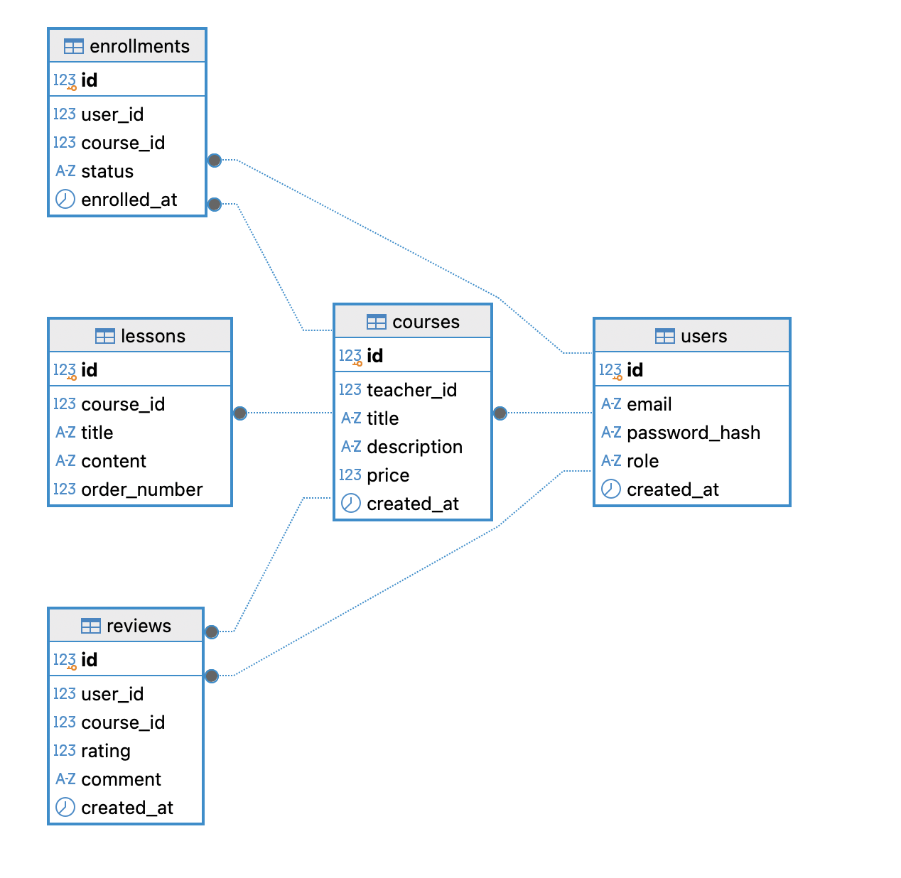

# db-homework-1
ДЗ №1. Вариант 1: Онлайн-курсы (EdTech)

## Задание 1. Концептуальная модель (1 балл)

**Сущности**
1. User (Пользователь) - студент или преподаватель.
2. Course (Курс) - обучающий курс.
3. Lesson (Урок) - чать курса.
4. Enrollment (Запись на курс) - связывает студенат и курс.
5. Review (Отзыв) - оценка и комментарий к курсу.

**Связи между сущностями:**
- Один пользователь (User) может создать много курсов (Course). Связь "Один-ко-Многим" (1:M)
- Один курс (Course) может иметь много уроков (Lesson). Связь "Один-ко-Многим" (1:M)
- Один курс (Course) может иметь много записей пользователей (Enrollment). Связь "Один-ко-Многим" (1:M)
- Один студент (User) может оставит много отзывово (Review). "Один-ко-Многим" (1:M)
- Один курс (Course) может получить меного отзывов (Review). "Один-ко-Многим" (1:M)

## Задание 2. Логическая модель (2 балла)

**Атрибуты и ключи:**
Первичные ключи (PK) отмечены иконкой ключа, внешние ключи (FK) показаны 123 без ключа.

**Кардинальность связей (Crow's Foot):**
Все связи иметь модель один ко многим. "Воронья лапка" один ко многим - |(и три палочки вверх 45 градусов - прямо - вниз 45 градусов)

**Идентифицирующие и неидентифицирующие связи:**
*   **Неидентифицирующие связи:** Все связи в данной модели являются неидентифицирующими. Это значит, что первичный ключ родительской таблицы не входит в состав первичного ключа дочерней таблицы. Например, таблица `courses` имеет собственный первичный ключ `id`, а `teacher_id` является просто внешним ключом, ссылающимся на `users`.
*   **Идентифицирующие связи:** Все связи являются неинтифицирующими, потому что у каждой новой таблицы есть свой уникальный id(Первичный ключ) по SERIAL. 

## Задание 3. Физическая модель (2 балла)

- Физическая модель - это перевод моих набросков и логических цепей на язык программирования PostgreSQL. Создаем базу по определнным правилам и с определенным элементами.
- Блок 1 (Производимость) - Проверяем, что таких даблиц не существует до их создания, а если существует, то мы их удаляеме вместе с их связями(зависимостями; CASCADE). Удаляем строго в порядке от дочерних до родительских, чтобы если мы удалили впереди родительскию, то не было пустых значений. (Например, удалили вначале USERS, а COURSES - пропал учитель, которых этот курс создал)
- Пример: DROP TABLE IF EXISTS courses CASCADE

Полный SQL-скрипт для создания базы данных находится в файле [`init_homework.sql`](./init_homework.sql).
- Для внешних ключей добавлен индексы, для ускорения поиска. Часто ищут по внешним ключам.

## Задание 4. Частые запросы (1 балл)

1. "Вывести 5 самых лучших курсов по рейтингу(оенки)"
2. "Найти преподавателя с самым большим рейтингом по одному курсу"
3. "Найти курс с самым большим числом записавшихся учениеом"
4. "Найти ученика прошедшего 10 курсов"
5. "Найти 10 курсов с самым больши объёмом уроков"
6. "Найти среднюю зарплату преподавателя за продажу курсов за год"