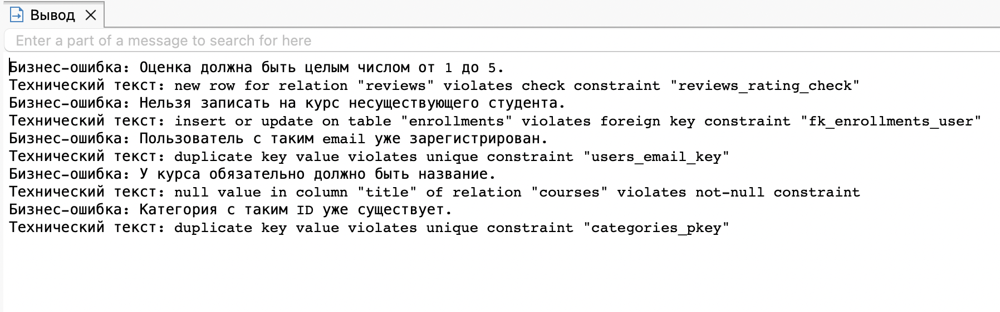

# Домашнее задание №2

**Студент:** Сальков Ефим Павлович
**Группа:** Дэ 16-25
**Вариант:** №1. Онлайн-курсы (EdTech)

---

## Часть 1. Дополнение схемы

Создана две новые таблицы `categories`(для категорий различных курсов) и `course_categories`(связывающая категорию и курс) в `course_categories` используется составной PK

**Новые таблицы:**
- `categories` — категории курсов.
- `course_categories` — связующая таблица для M:N.

**Способ реализации M:N:** через промежуточную таблицу `course_categories` с составным первичным ключом `(course_id, category_id)`.

**Что происходит при DROP CASCADE:** при удалении курса или категории все связи в `course_categories` автоматически удаляются (`ON DELETE CASCADE`), сами курсы и категории остаются.

Полный SQL-скрипт: [`hw2_part1.sql`](./hw2_part1.sql)

---

## Часть 2. Демонстрация нарушений

Скрипт из 5 блоков `DO $$ ... EXCEPTION ... END $$`, который намеренно нарушает ограничения и перехватывает ошибки.

Скриншот: 

Полный SQL-скрипт: [`hw2_part2.sql`](./hw2_part2.sql)

---

## Часть 3. Документирование нарушений

| № | Ограничение | Выполняемый запрос (SQL) | Сообщение СУБД | Понятное сообщение для пользователя | Как исправить |
|---|---|---|---|---|---|
| 1 | CHECK | `INSERT INTO reviews (user_id, course_id, rating) VALUES (1, 1, 10);` | `new row for relation "reviews" violates check constraint "reviews_rating_check"` | «Оценка должна быть целым числом от 1 до 5» | Указать корректное значение (например, 5) |
| 2 | FOREIGN KEY | `INSERT INTO enrollments (user_id, course_id) VALUES (99999, 1);` | `insert or update on table "enrollments" violates foreign key constraint "fk_enrollments_user"` | «Нельзя записать на курс несуществующего студента» | Сначала создать пользователя в таблице `users` |
| 3 | UNIQUE | `INSERT INTO users (email, ...) VALUES ('unique_check@example.com', ...);` | `duplicate key value violates unique constraint "users_email_key"` | «Пользователь с таким email уже зарегистрирован» | Использовать другой email |
| 4 | NOT NULL | `INSERT INTO courses (teacher_id, title) VALUES (1, NULL);` | `null value in column "title" of relation "courses" violates not-null constraint` | «У курса обязательно должно быть название» | Указать название курса |
| 5 | PRIMARY KEY | `INSERT INTO categories (id, name) VALUES (1, 'Дубликат id');` | `duplicate key value violates unique constraint "categories_pkey"` | «Категория с таким ID уже существует» | Не указывать ID вручную, доверить его `SERIAL` |

### Вывод

5 оганичений работают корректно и не дают возможность допустить ошибку пользователю, объясняя ему при ошибке в чем проблема.