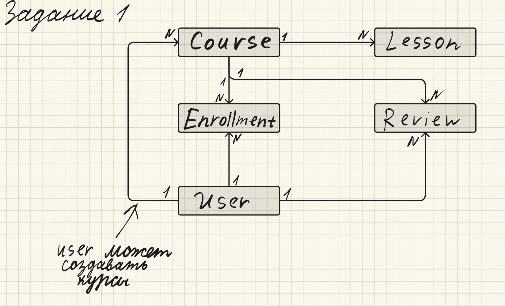
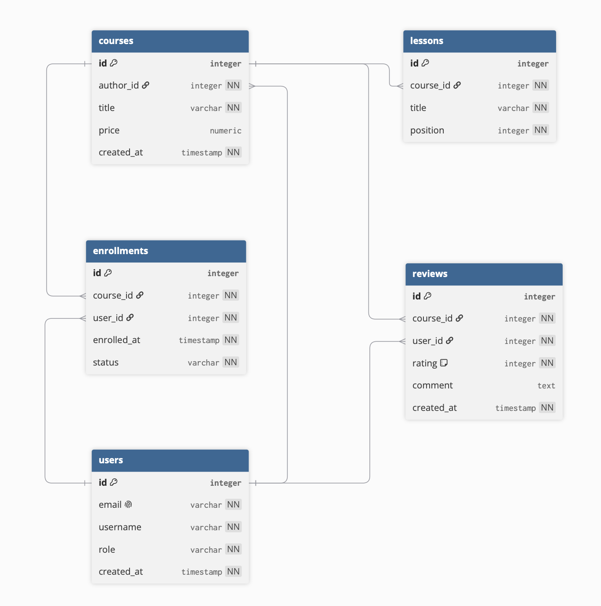

# ДЗ №1. Вариант 1: Онлайн-курсы (EdTech)


## Как запустить

Нужен Docker. Поднять контейнер с PostgreSQL 16:

```bash
docker run -d --name pg16_check \
  -e POSTGRES_PASSWORD=postgres \
  -p 5432:5432 postgres:16
```

Выполнить скрипт:

```bash
docker cp Дз1.sql pg16_check:/tmp/hw1.sql
docker exec -i pg16_check psql -U postgres -f /tmp/hw1.sql
```

Скрипт работает в отдельной схеме `hw1` и начинается с `DROP SCHEMA IF EXISTS hw1 CASCADE`,
поэтому его можно запускать сколько угодно раз — результат всегда одинаковый, и ничего
за пределами схемы `hw1` не затрагивается.

Проверить, что всё создалось:

```bash
docker exec -it pg16_check psql -U postgres -c "\dt hw1.*"
docker exec -it pg16_check psql -U postgres \
  -c "SELECT tablename, indexname FROM pg_indexes WHERE schemaname='hw1' ORDER BY 1,2;"
```

Ожидается 5 таблиц и 12 индексов: 6 созданных явно на внешние ключи, 5 автоматических
под первичные ключи и 1 автоматический под `UNIQUE` на email.

При подключении из графического клиента таблицы находятся в схеме `hw1`, а не в `public`.
Чтобы обращаться к ним без префикса, в каждой новой сессии нужно выполнить
`SET search_path TO hw1;`.

## Соответствие бизнес-требований и модели

Каждое решение в модели выведено из конкретной фразы бизнес-домена.

| Бизнес-требование | Что из него следует |
|---|---|
| «Платформа позволяет пользователям регистрироваться» | Сущность `users`. Регистрация требует уникального идентификатора входа, отсюда `email varchar UNIQUE NOT NULL` |
| «Преподаватели могут создавать курсы» | Связь `users` 1:N `courses` через `courses.author_id NOT NULL`. Отдельная сущность для преподавателя не заводится — роль хранится в `users.role` |
| «Пользователи могут выбирать курсы и проходить обучение» | Сущность `enrollments`. Отношение между пользователем и курсом многие-ко-многим, поэтому нужна промежуточная сущность. Ход обучения отражает `status` |
| «Каждый курс состоит из нескольких уроков» | Сущность `lessons`, связь `courses` 1:N `lessons`. Слово «состоит» подразумевает порядок, отсюда атрибут `position` |
| «Студенты могут оставлять отзывы на курсы и оценивать их по шкале от 1 до 5» | Сущность `reviews` с атрибутами `rating` и `comment`. Отношение снова многие-ко-многим и снова разрешено отдельной сущностью |
| «Преподаватели получают отчисления от продаж» | Атрибут `courses.price`. Сумма к выплате вычисляется по записям на курсы автора, отдельная сущность для платежей в минимальную модель не вводится |

## 1. Концептуальная модель



На этом уровне указаны только сущности и связи между ними. Без атрибутов, типов данных
и ключей.

### Сущности

**`User`** — зарегистрированный пользователь платформы (студент, учитель).

**`Course`** — учебный курс целиком.

**`Lesson`** — отдельный урок внутри курса.

**`Enrollment`** — факт записи пользователя на курс.

**`Review`** — отзыв пользователя о курсе с оценкой.

### Почему `User` один, а не студент и преподаватель отдельно

Разделять пользователей на две сущности не потребовалось. Это один и тот же человек,
и преподаватель может проходить чужие курсы наравне со студентами. Различие ролей
хранится атрибутом.

Именно поэтому от `User` к `Course` идут две разные связи: прямая (пользователь создаёт
курсы, выступая преподавателем) и через `Enrollment` (пользователь проходит курсы,
выступая студентом).

## 2. Логическая модель



Диаграмма построена в dbdiagram.io в нотации «воронья лапка» (Crow's Foot): одиночная черта обозначает сторону «один», раздвоенный символ — сторону «многие».

### Атрибуты и ключи

| Сущность | Атрибуты | PK | FK |
|---|---|---|---|
| `users` | `id`, `email`, `username`, `role`, `created_at` | `id` | — |
| `courses` | `id`, `author_id`, `title`, `price`, `created_at` | `id` | `author_id` на `users.id` |
| `lessons` | `id`, `course_id`, `title`, `position` | `id` | `course_id` на `courses.id` |
| `enrollments` | `id`, `user_id`, `course_id`, `enrolled_at`, `status` | `id` | `user_id` на `users.id`, `course_id` на `courses.id` |
| `reviews` | `id`, `user_id`, `course_id`, `rating`, `comment`, `created_at` | `id` | `user_id` на `users.id`, `course_id` на `courses.id` |

### Кардинальность связей

| Связь | Тип | Чтение |
|---|---|---|
| `users` — `courses` | 1:N | Один преподаватель создаёт много курсов, у каждого курса один автор |
| `courses` — `lessons` | 1:N | Один курс содержит много уроков, каждый урок принадлежит одному курсу |
| `users` — `enrollments` | 1:N | Один пользователь делает много записей, каждая запись принадлежит одному пользователю |
| `courses` — `enrollments` | 1:N | На один курс много записей, каждая запись относится к одному курсу |
| `users` — `reviews` | 1:N | Один пользователь пишет много отзывов, каждый отзыв написан одним пользователем |
| `courses` — `reviews` | 1:N | У одного курса много отзывов, каждый отзыв относится к одному курсу |

Исходные отношения `users` — `courses` (по обучению) и `users` — `courses` (по отзывам)
имеют тип M:N. На логическом уровне они разложены на пары связей 1:N через `enrollments`
и `reviews` соответственно, поскольку реляционная модель не позволяет выразить M:N
напрямую.

### Идентифицирующие и неидентифицирующие связи

Связь идентифицирующая, если внешний ключ входит в первичный ключ дочерней сущности.
Если у дочерней сущности собственный независимый первичный ключ, связь
неидентифицирующая.

Все шесть связей модели неидентифицирующие: у каждой сущности суррогатный ключ `id`,
и ни в одном случае внешний ключ в него не входит.

Выбор осознанный. Для `enrollments` альтернативой был составной ключ
`(user_id, course_id)`, который сделал бы связи с `users` и `courses`
идентифицирующими. Но он навсегда запретил бы повторную запись на курс, а по
бизнес-домену студент может отчислиться и записаться заново.

## 3. Физическая модель

Полный скрипт: [`Дз1.sql`](Дз1.sql).

### Выбор типов данных

| Тип | Где применён | Обоснование |
|---|---|---|
| `integer` | все первичные и внешние ключи, `rating`, `position` | Целые числа без дробной части, диапазона с запасом хватает для учебной платформы |
| `varchar` | `email`, `username`, `role`, `title`, `status` | Короткие строки ограниченной длины |
| `text` | `comment` | Текст отзыва не имеет разумного верхнего предела, ограничивать его длиной нельзя |
| `numeric` | `price` | Денежные суммы требуют точной десятичной арифметики. Тип с плавающей точкой здесь недопустим: он даёт ошибки округления при суммировании, а по деньгам считаются выплаты преподавателям |
| `timestamp` | `created_at`, `enrolled_at` | Нужны и дата, и время: две записи на курс в один день должны различаться по моменту |

### Ограничения целостности

**`PRIMARY KEY`** — на `id` каждой из пяти таблиц.

**`FOREIGN KEY`** — шесть штук, по числу связей: `courses.author_id`, `lessons.course_id`,
`enrollments.user_id`, `enrollments.course_id`, `reviews.user_id`, `reviews.course_id`.
Они гарантируют, что нельзя создать урок в несуществующем курсе или отзыв от
несуществующего пользователя.

**`NOT NULL`** — на всех атрибутах, обязательных по бизнес-логике. Единственные
необязательные поля: `courses.price` (курс может быть бесплатным) и `reviews.comment`
(оценку можно поставить без текста).

**`UNIQUE`** — на `users.email`. Прямое следствие требования о регистрации: два аккаунта
с одной почтой означали бы невозможность входа.

### Индексы

На каждый внешний ключ создан индекс:

```sql
CREATE INDEX idx_courses_author_id ON courses (author_id);
CREATE INDEX idx_lessons_course_id ON lessons (course_id);
CREATE INDEX idx_enrollments_user_id ON enrollments (user_id);
CREATE INDEX idx_enrollments_course_id ON enrollments (course_id);
CREATE INDEX idx_reviews_user_id ON reviews (user_id);
CREATE INDEX idx_reviews_course_id ON reviews (course_id);
```


### Воспроизводимость

Скрипт начинается с трёх строк:

```sql
DROP SCHEMA IF EXISTS hw1 CASCADE;
CREATE SCHEMA hw1;
SET search_path TO hw1;
```

`IF EXISTS` позволяет отработать первому запуску, когда схемы ещё нет. `CASCADE` удаляет
схему вместе со всем содержимым. Работа в отдельной схеме изолирует модель от остальных
объектов базы, поэтому повторный прогон всегда даёт одинаковый результат и ничего
постороннего не затрагивает.

## 4. Частые запросы

Пять наиболее частых обращений к базе, сформулированных словами.

**1. Сколько уроков содержит конкретный курс?**

**2. Сколько студентов записалось на конкретный курс за определённую дату?**

**3. Сколько у курса отзывов с оценкой ниже 3?**

**4. Сколько курсов стоит дешевле или дороже заданной суммы?**

**5. Сколько на платформе преподавателей и сколько студентов?**


## Что было сделано

Разобран бизнес-домен платформы онлайн-образования, из него выделены пять сущностей
и связи между ними.
Модель последовательно проведена через три уровня: концептуальный (сущности и связи),
логический (атрибуты, ключи) и физический (SQL-скрипт для PostgreSQL
с типами данных, ограничениями целостности и индексами на внешние ключи).

Скрипт воспроизводим и работает в изолированной схеме и корректно отрабатывает при
повторном запуске.
