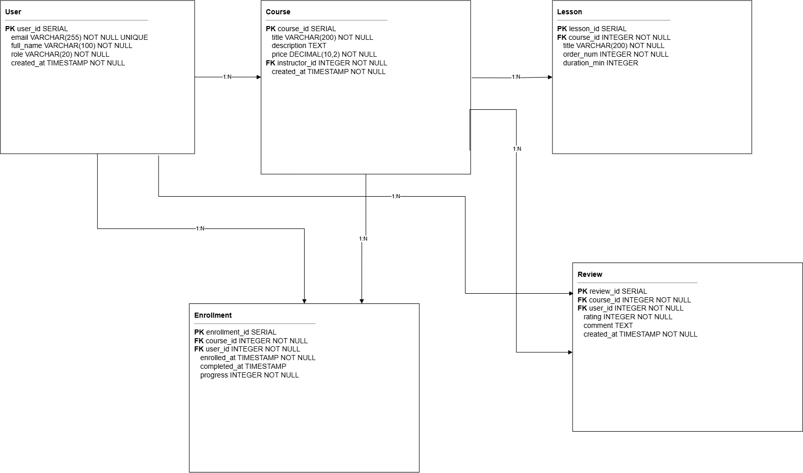

# ДЗ №1. Вариант 1: Онлайн-курсы (EdTech)

## Задание 1. Концептуальная модель

**Сущности:**
- **User** - пользователь платформы (студент, преподаватель, админ).
- **Course** - курс, созданный преподавателем.
- **Lesson** - урок внутри курса.
- **Enrollment** - факт записи студента на курс.
- **Review** - отзыв студента о курсе.

**Связи:**
- User - Course: один преподаватель ведёт много курсов.
- Course - Lesson: один курс содержит много уроков.
- User -> Enrollment <- Course: студент записывается на много курсов, курс принимает много студентов (M:N через Enrollment).
- User -> Review <- Course: студент оставляет отзывы на много курсов, курс собирает много отзывов (M:N через Review).

## Задание 2. Логическая модель

Схема 

**User:** PK user_id; email - уникальный, обязательный; full_name - обязательный; role - обязательный, только student/instructor/admin; created_at - обязательный, по умолчанию текущее время.

**Course:** PK course_id; FK instructor_id -> User.user_id; title - обязательный; description - текст; price - обязательный, не отрицательный; created_at - по умолчанию текущее время.

**Lesson:** PK lesson_id; FK course_id -> Course.course_id (каскад); title - обязательный; order_num - обязательный, больше нуля, уникален вместе с course_id; duration_min - больше нуля.

**Enrollment:** PK enrollment_id; FK course_id -> Course.course_id (каскад); FK user_id -> User.user_id (каскад); enrolled_at - по умолчанию текущее время; completed_at - может быть пустым; progress - обязательный, по умолчанию 0, от 0 до 100; пара user_id и course_id уникальна.

**Review:** PK review_id; FK course_id -> Course.course_id (каскад); FK user_id -> User.user_id (каскад); rating - обязательный, от 1 до 5; comment - текст; created_at - по умолчанию текущее время; пара user_id и course_id уникальна.

Внешние ключи нужны, чтобы дочерние записи ссылались только на существующие родительские.

**Кардинальность:** User-Course 1:N, Course-Lesson 1:N, User-Enrollment 1:N, Course-Enrollment 1:N, User-Review 1:N, Course-Review 1:N.

Все связи неидентифицирующие - у каждой дочерней таблицы свой суррогатный PK, внешний ключ в PK не входит.

M:N реализованы через таблицы-связки Enrollment и Review. Это позволяет хранить дополнительные атрибуты связи: progress, completed_at, rating, comment.

DROP CASCADE: удаление user тянет за собой course, enrollment, review и lesson; удаление course тянет lesson, enrollment, review; удаление lesson затрагивает только его.

## Задание 3. Физическая модель

SQL-скрипт - [DZ-1.sql](DZ-1.sql).

- `DROP TABLE IF EXISTS ... CASCADE` в начале - для воспроизводимости, порядок от дочерних к родительским.
- `SERIAL` - для PK.
- `VARCHAR` - для коротких строк, `TEXT` - для длинных.
- `INTEGER` - для FK и счётчиков, `DECIMAL(10,2)` - для цены, `TIMESTAMP` - для дат.
- `NOT NULL` - на обязательных полях.
- `UNIQUE` - на email, на парах user_id+course_id в Enrollment и Review, на паре course_id+order_num в Lesson.
- `CHECK` - на role, price, order_num, duration_min, progress, rating.
- `DEFAULT CURRENT_TIMESTAMP` - на created_at и enrolled_at, `DEFAULT 0` - на progress.
- `ON DELETE CASCADE` - в Lesson, Enrollment, Review.
- Индексы на FK: `idx_course_instructor_id`, `idx_lesson_course_id`, `idx_enrollment_course_id`, `idx_enrollment_user_id`, `idx_review_course_id`, `idx_review_user_id`.

## Задание 4. Частые запросы

1. Вывести список всех курсов с количеством записавшихся студентов.
2. Найти 10 самых популярных курсов по количеству отзывов и средней оценке.
3. Показать все уроки конкретного курса в правильном порядке.
4. Получить историю обучения студента: какие курсы он прошёл и какие оценки получил.
5. Рассчитать сумму, которую должен получить преподаватель за месяц по всем своим курсам.